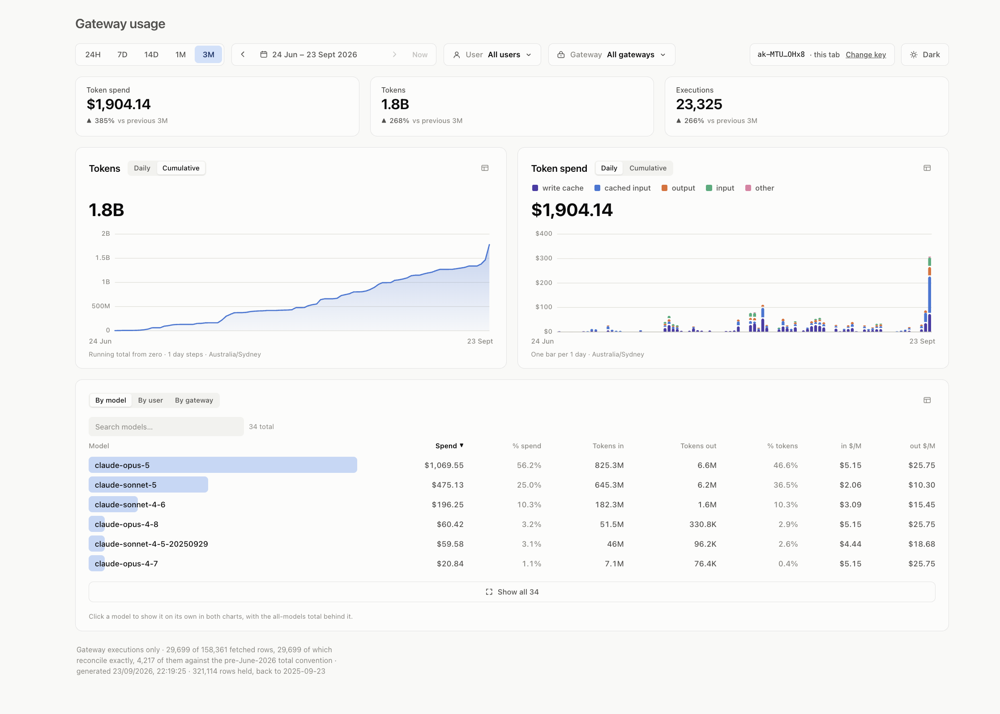

# Airia gateway usage dashboard

Paste an Airia API key and it builds itself: what the LLM gateway cost, who
spent it, on which models, through which gateway.

A key is scoped to one tenant, so a different key gives you that tenant's
dashboard. That's the point — it's meant to be handed to a customer to run
against their own data.

## The questions it answers in one look

- **What are we spending, and is that up or down?** Spend, tokens and
  executions, each against the equal period immediately before — so "$1,847,
  up 371% on the previous three months", not a number with no context.
- **What are we paying *for*?** Spend is split by billing category — write
  cache, cached input, output, input — because they price very differently and
  the mix is usually the story. On this tenant write-cache alone is the single
  largest line item.
- **Which model actually costs what?** A per-row rate card in real `$/M`,
  computed *within* each token category. A blended rate ranks models by cache
  hit rate rather than by price, and on real data it put the cheapest model
  per token at the top as the most expensive.
- **Who or what is driving it?** Break down by **model**, **user** or
  **gateway**, with spend share, tokens in/out and the rate card on every row.
- **Was it always like this?** Any window from one day to a year, and the
  grain follows the span, so a day of traffic and a year of it are both
  readable without choosing a bucket size.
- **What does one slice look like on its own?** Filter to some users, or a
  gateway, or both, and everything recomputes — tiles, charts, every
  breakdown, and the comparison period. Click a row and it's drawn alone with
  the scoped whole behind it in grey, on the same scale, so absolute size and
  share read at once.

Charts are hand-rolled SVG. There is no charting library.



## Quick start

```bash
npm install
npm run dev        # http://localhost:5173, then paste a key
```

For the built app: `npm run build && npm start` (http://localhost:4173).

## Running it locally

The Airia API sends no CORS headers, so a browser can't call it directly
however valid your key. The page calls `/airia/…` on its **own** origin and
something local forwards it — Vite's proxy in dev, `server.mjs` for the
build. That makes this a local tool, not a link you can send, and it's why
`server.mjs` binds to `127.0.0.1`: every request through the proxy carries
the caller's key.

Nothing is stored. Rows are fetched into the tab, aggregated in the browser
and dropped when you close it; the key lives in memory unless you opt into
`sessionStorage`, and is only ever sent as a request header. The repo is
public and rows carry user emails, so nothing tenant-shaped touches disk.

## Stack

React 19 + TypeScript + Vite. No charting, state or UI dependencies.

```
src/theme/      colour — the only place hex values exist
src/lib/        maths, dates, fetch + aggregation (pure, no React)
src/components/ the chart kit
src/data/       folds the fact table into series and breakdowns
src/App.tsx     the dashboard
server.mjs      serves the build and proxies /airia
```

Each time range is **one sparse fact table** keyed by (bucket, user, model,
gateway), and everything on the page folds out of it — which is what lets a
filter be a real scope rather than a highlight.

## Development

```bash
npm run chrome &            # headless Chrome, for the browser checks
export AIRIA_API_KEY=...
npm run check               # types, colour, layout, console
```

There's no unit suite. Four gates stand in for one, because the bugs worth
catching here were never type errors: `check:palette` measures contrast and
colourblind separation, `check:layout` measures the layout invariants,
`check:console` drives every control and fails on any React warning, and
`scripts/probe.mjs` runs expressions against the real modules in the live
page — which is how the aggregation is tested against real rows.

`scripts/shoot.mjs` takes screenshots, including hover states, and
`scripts/measure-load.mjs` reports load timings and request counts. All of
them read the key from `AIRIA_API_KEY`, never an argument.

Buckets align to `Australia/Sydney` (`ZONE` in `src/data/airia.ts`) and
history is capped at Airia's 365-day log retention; nothing else needs
configuring.

**`CLAUDE.md` is the real documentation** — the data contract, the reducer
table, the time-zone and daylight-saving rules, and the mistakes worth not
repeating. Read it before changing anything.
