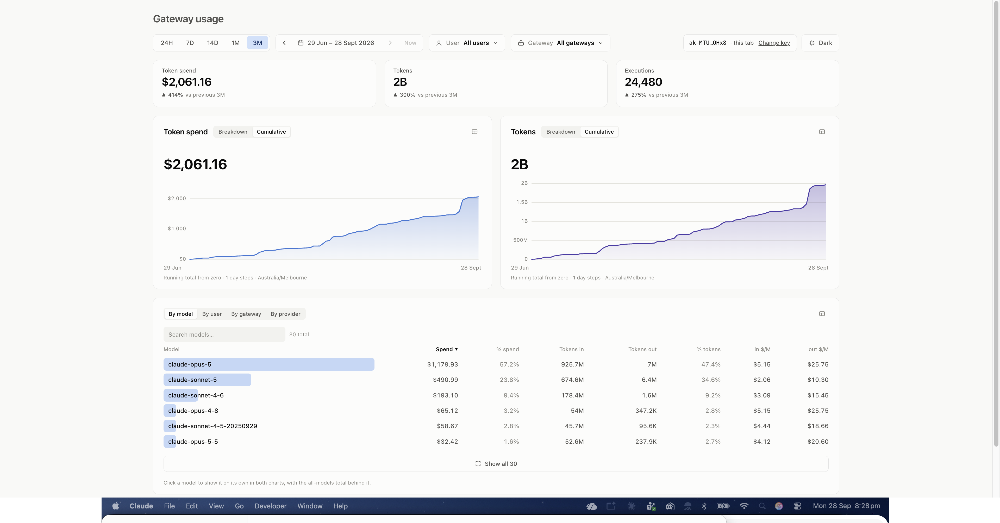

# Airia gateway usage dashboard

Paste an Airia API key and the dashboard builds itself.

## The questions it answers in one look
- **What are we spending?** Spend and consumption tracked over time, so you can see trend, not just a snapshot.
- **Who or what is driving it?** Drill down by user, provider, model, or gateway to see where spend actually comes from.
- **What are we paying for?** Spend broken out by input, output, write-cache, and read-cache — the categories that price differently.
- **Was it always like this?** Analyse any window, from a single day to a full year.
- **What does a slice look like on its own?** Filter to a specific user, gateway, or both, and see that slice on its own.

Charts are hand-rolled SVG



**Walkthrough video:**

[](https://youtu.be/eBOWguFukkU)

## Quick start

```bash
npm install
npm run dev        # http://localhost:5173, then paste a key
```

For the built app: `npm run build && npm start` (http://localhost:4173).

## Running it locally

The Airia API sends no CORS headers, so a browser can't call it directly
however valid your key. The page calls `/airia/…` on its **own** origin and
something local forwards it — `proxy.mjs`, run by Vite in dev and by
`server.mjs` for the build.

Pick the environment on the key page: one of Airia's SaaS regions (US East
by default; Australia East, Canada Central, Netherlands West, Singapore,
UAE North), or **Custom** for a cloud-prem address such as
`https://example.airia.ai` — its API host, `example.api.airia.ai`, is worked
out for you. The proxy forwards to any `*.airia.ai` host; set
`AIRIA_EXTRA_HOSTS=api.example.com` to allow one on another domain.

Nothing is stored. Rows are fetched into the tab, aggregated in the browser
and dropped when you close it; the key lives in memory unless you opt into
`sessionStorage`, and is only ever sent as a request header. The repo is
public and rows carry user emails, so nothing tenant-shaped touches disk.

## Stack

React 19 + TypeScript + Vite.

```
src/theme/      colour — the only place hex values exist
src/lib/        maths, dates, fetch + aggregation (pure, no React)
src/components/ the chart kit
src/data/       folds the fact table into series and breakdowns
src/App.tsx     the dashboard
server.mjs      serves the build and proxies /airia
proxy.mjs       the /airia proxy, shared by Vite and server.mjs
```

Each time range is **one sparse fact table** keyed by (bucket, user, model,
gateway), and everything on the page folds out of it — which is what lets a
filter be a real scope rather than a highlight.

## Development

```bash
npm run chrome &            # headless Chrome, for the browser checks
export AIRIA_API_KEY=...
npm run check               # types, colour, layout, console
```

There's no unit suite. Four gates stand in for one, because the bugs worth
catching here were never type errors: `check:palette` measures contrast and
colourblind separation, `check:layout` measures the layout invariants,
`check:console` drives every control and fails on any React warning, and
`scripts/probe.mjs` runs expressions against the real modules in the live
page — which is how the aggregation is tested against real rows.

`scripts/shoot.mjs` takes screenshots, including hover states, and
`scripts/measure-load.mjs` reports load timings and request counts. All of
them read the key from `AIRIA_API_KEY`, never an argument.

Buckets align to **your own timezone** — days are cut at your midnight, not
someone else's. Add `?tz=Europe/London` to look at a tenant's traffic in the
zone their team works in. History is capped at Airia's 365-day log
retention; nothing else needs configuring.

**`CLAUDE.md` is the real documentation** — Read it before changing anything.
